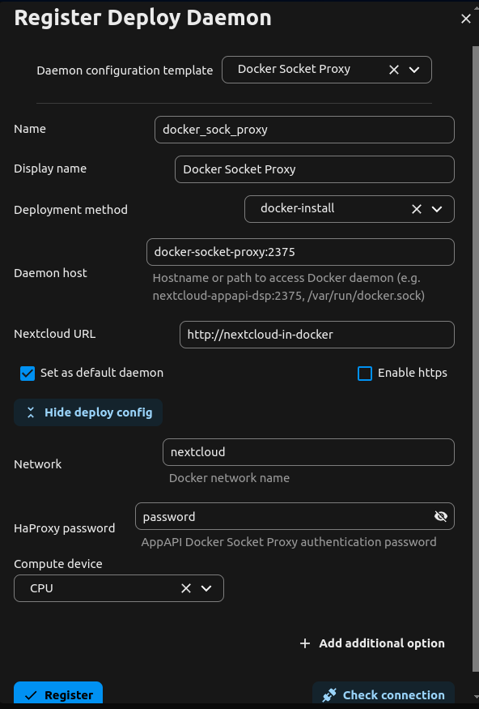

# Workflow OCR Backend


This is an alternative backend for the [workflow_ocr](https://github.com/R0Wi-DEV/workflow_ocr) Nextcloud App.
It's written in Python and provides a simple REST API for [ocrmypdf](https://ocrmypdf.readthedocs.io/en/latest/).

- [Workflow OCR Backend](#workflow-ocr-backend)
  - [Prerequisites](#prerequisites)
  - [Installation](#installation)
  - [`docker-compose` Example](#docker-compose-example)

## Prerequisites

This app should be installed via Nextcloud [ExApp / AppApi](https://docs.nextcloud.com/server/latest/admin_manual/exapps_management/AppAPIAndExternalApps.html).
It will take care of all the heavy lifting like installation, orchestration, configuration and authentication between Nextcloud and this backend implementation.

1. Install [`docker`](https://docs.docker.com/engine/install/ubuntu/) on the host where the app should be installed.
2. Install the [`AppApi`](https://docs.nextcloud.com/server/latest/admin_manual/exapps_management/AppAPIAndExternalApps.html#installing-appapi) app. It will take care of the installation and orchestration of the backend as Docker Container.
3. Setup a [Deploy Daemon](https://docs.nextcloud.com/server/latest/admin_manual/exapps_management/AppAPIAndExternalApps.html#setup-deploy-daemon). It's recommended to use the [Docker Socket Proxy](https://github.com/nextcloud/docker-socket-proxy#readme) to communicate with the docker daemon.

## Installation

The easiest way to install this app is to use the [Nexcloud Appstore](https://docs.nextcloud.com/server/latest/admin_manual/exapps_management/AppAPIAndExternalApps.html#installing-exapps).

Alternatively, use the folling [`occ`](https://docs.nextcloud.com/server/latest/admin_manual/occ_command.html) command to register the latest version of this app:

```bash
sudo -u www-data php occ app_api:app:register workflow_ocr_backend \
	--force-scopes \
	--info-xml https://raw.githubusercontent.com/R0Wi-DEV/workflow_ocr_backend/refs/heads/master/appinfo/info.xml
```

Use `sudo -u www-data php occ app_api --help` to get a full list of AppApi commands.

## `docker-compose` Example

If you want to run both Nextcloud **and** this backend in Docker, you can use the following `docker-compose.yml` to start Nextcloud, a database and the docker-socket-proxy. 

Create a new docker network first:

```bash
docker network create nextcloud
```

Then create a `docker-compose.yml` file with the following content:

```yaml
volumes:
  nextcloud:
  db:

networks:
  nextcloud:
    name: nextcloud
    external: true

services:
  db:
    image: mariadb:10.6
    restart: no
    command: --transaction-isolation=READ-COMMITTED --log-bin=binlog --binlog-format=ROW
    volumes:
      - db:/var/lib/mysql
    environment:
      - MYSQL_ROOT_PASSWORD=
      - MYSQL_PASSWORD=
      - MYSQL_DATABASE=nextcloud
      - MYSQL_USER=nextcloud
      - MARIADB_ROOT_PASSWORD=nextcloud
    networks:
      - nextcloud

  app:
    image: nextcloud:<version>
    container_name: nextcloud-in-docker
    restart: no
    ports:
      - 80:80
    volumes:
      - nextcloud:/var/www/html
    environment:
      - MYSQL_PASSWORD=
      - MYSQL_DATABASE=nextcloud
      - MYSQL_USER=nextcloud
      - MYSQL_HOST=db
      - PHP_MEMORY_LIMIT=1024M
      - PHP_UPLOAD_LIMIT=1024M
    networks:
      - nextcloud

  nextcloud-cron:
    image: nextcloud:<version>
    container_name: nextcloud-in-docker-cron
    restart: no
    volumes:
      - nextcloud:/var/www/html
    entrypoint: /cron.sh
    depends_on:
      - app
    networks:
      - nextcloud
    environment:
      - PHP_MEMORY_LIMIT=1024M
      - PHP_UPLOAD_LIMIT=1024M

  # Proxy for Docker Socket
  nextcloud-appapi-dsp:
    image: ghcr.io/nextcloud/nextcloud-appapi-dsp:release
    container_name: docker-socket-proxy
    hostname: nextcloud-appapi-dsp
    environment:
      - NC_HAPROXY_PASSWORD=password
    volumes:
      - /var/run/docker.sock:/var/run/docker.sock
    restart: no
    privileged: true
    networks:
      - nextcloud
```

Adjust the values for `<version>` and `NC_HAPROXY_PASSWORD` to your needs, then start the stack with `docker-compose up -d`.

The Deploy Daemon configuration for this setup would look like this:

<p align="center">
    
</p>

>  :warning: Make sure to create the docker network `nextcloud` before starting the stack. If you don't declare the network as
> `external`, `docker-compose` will create the network with some [project/directory prefix](https://docs.docker.com/compose/how-tos/networking/), which will cause the Deploy Daemon to fail because it doesn't find the network.